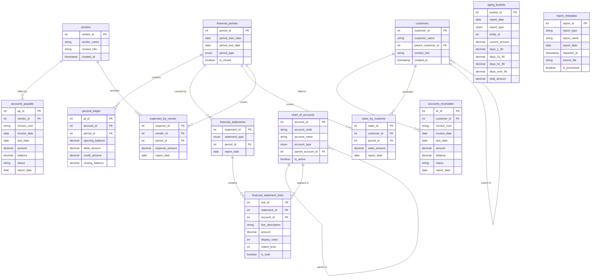

# Base Source Data Requirements

**1. Source Financial Reports (Types/Schemas)**
*   General Ledger (schema_type: `general_ledger`)
*   AP Summary (schema_type: `ap_summary`)
*   Payroll Summary (schema_type: `payroll_summary`)
*   AR Aging (schema_type: `ar_aging`)
**2. Final Executive Report**
* GenSeq Daily Financial Summary (The title/name of the final report)  
	* Email, Teams, Slack, etc delivery
	* Saved to repository or db

---
# Public SEC Reports

1. Balance Sheet
2. Income Statement
3. Statement of Cash Flows
4. Statement of Shareholders' Equity
5. Various footnotes and management discussion

These are typically found in quarterly (10-Q) and annual (10-K) filings with the SEC.

---

**Unified Analyis Re-Worked:**

**✅ Submodules & Analysis Domains**
Process each incoming data module (e.g., RevenueModule, CostModule, etc.) through the following submodule lenses:

**📈 1. Revenue Analysis**
Goal: Detect revenue performance trends, volatility, and opportunity.

**💸 2. Cost & Expense Analysis**
Goal: Uncover cost inefficiencies, budget overruns, or optimization targets.

**👷 3. Labor & Payroll Analysis**
Goal: Assess labor cost efficiency and risk.

**📦 4. Receivables Analysis**
Goal: Detect cash flow risk and underperforming receivables.

**⚠️ 5. Anomaly Detection**
Goal: Flag anything numerically or structurally irregular.

**📊 6. Pattern Recognition & Opportunity Mining**
Goal: Identify strategic signals based on behavioral, financial, or structural trends.

---

# SQL Database for Base Source Reports

Database Schema for Financial Reporting
```sql
-- Vendors table to store vendor information
CREATE TABLE vendors (
    vendor_id INT PRIMARY KEY AUTO_INCREMENT,
    vendor_name VARCHAR(100) NOT NULL,
    contact_info VARCHAR(255),
    created_at TIMESTAMP DEFAULT CURRENT_TIMESTAMP
);

-- Customers table to store customer information
CREATE TABLE customers (
    customer_id INT PRIMARY KEY AUTO_INCREMENT,
    customer_name VARCHAR(100) NOT NULL,
    parent_customer_id INT NULL, -- For sub-customers like Freeman Sporting Goods
    contact_info VARCHAR(255),
    created_at TIMESTAMP DEFAULT CURRENT_TIMESTAMP,
    FOREIGN KEY (parent_customer_id) REFERENCES customers(customer_id)
);

-- Accounts Payable table for tracking payables
CREATE TABLE accounts_payable (
    ap_id INT PRIMARY KEY AUTO_INCREMENT,
    vendor_id INT NOT NULL,
    invoice_num VARCHAR(50),
    invoice_date DATE NOT NULL,
    due_date DATE NOT NULL,
    amount DECIMAL(10, 2) NOT NULL,
    balance DECIMAL(10, 2) NOT NULL,
    status VARCHAR(20) DEFAULT 'OPEN',
    report_date DATE NOT NULL, -- Date when this data was reported
    FOREIGN KEY (vendor_id) REFERENCES vendors(vendor_id)
);

-- Accounts Receivable table for tracking receivables
CREATE TABLE accounts_receivable (
    ar_id INT PRIMARY KEY AUTO_INCREMENT,
    customer_id INT NOT NULL,
    invoice_num VARCHAR(50) NOT NULL,
    invoice_date DATE NOT NULL,
    due_date DATE NOT NULL,
    amount DECIMAL(10, 2) NOT NULL,
    balance DECIMAL(10, 2) NOT NULL,
    status VARCHAR(20) DEFAULT 'OPEN',
    report_date DATE NOT NULL, -- Date when this data was reported
    FOREIGN KEY (customer_id) REFERENCES customers(customer_id)
);

-- Aging buckets table to track aging of AP/AR
CREATE TABLE aging_buckets (
    bucket_id INT PRIMARY KEY AUTO_INCREMENT,
    report_date DATE NOT NULL,
    report_type ENUM('AP', 'AR') NOT NULL,
    entity_id INT NOT NULL, -- vendor_id or customer_id
    current_amount DECIMAL(10, 2) DEFAULT 0,
    days_1_30 DECIMAL(10, 2) DEFAULT 0,
    days_31_60 DECIMAL(10, 2) DEFAULT 0,
    days_61_90 DECIMAL(10, 2) DEFAULT 0,
    days_over_90 DECIMAL(10, 2) DEFAULT 0,
    total_amount DECIMAL(10, 2) DEFAULT 0,
    UNIQUE KEY (report_date, report_type, entity_id)
);

-- Chart of Accounts
CREATE TABLE chart_of_accounts (
    account_id INT PRIMARY KEY AUTO_INCREMENT,
    account_code VARCHAR(20) NOT NULL UNIQUE,
    account_name VARCHAR(100) NOT NULL,
    account_type ENUM('ASSET', 'LIABILITY', 'EQUITY', 'INCOME', 'EXPENSE', 'COST_OF_GOODS_SOLD') NOT NULL,
    parent_account_id INT NULL, -- For hierarchical accounts
    is_active BOOLEAN DEFAULT TRUE,
    FOREIGN KEY (parent_account_id) REFERENCES chart_of_accounts(account_id)
);

-- Financial Periods
CREATE TABLE financial_periods (
    period_id INT PRIMARY KEY AUTO_INCREMENT,
    period_start_date DATE NOT NULL,
    period_end_date DATE NOT NULL,
    period_type ENUM('MONTH', 'QUARTER', 'YEAR') NOT NULL,
    is_closed BOOLEAN DEFAULT FALSE,
    UNIQUE KEY (period_start_date, period_end_date, period_type)
);

-- General Ledger
CREATE TABLE general_ledger (
    gl_id INT PRIMARY KEY AUTO_INCREMENT,
    account_id INT NOT NULL,
    period_id INT NOT NULL,
    opening_balance DECIMAL(12, 2) NOT NULL DEFAULT 0,
    debit_amount DECIMAL(12, 2) NOT NULL DEFAULT 0,
    credit_amount DECIMAL(12, 2) NOT NULL DEFAULT 0,
    closing_balance DECIMAL(12, 2) NOT NULL DEFAULT 0,
    FOREIGN KEY (account_id) REFERENCES chart_of_accounts(account_id),
    FOREIGN KEY (period_id) REFERENCES financial_periods(period_id),
    UNIQUE KEY (account_id, period_id)
);

-- Financial Statements table to store statement data
CREATE TABLE financial_statements (
    statement_id INT PRIMARY KEY AUTO_INCREMENT,
    statement_type ENUM('PROFIT_LOSS', 'BALANCE_SHEET', 'CASH_FLOW') NOT NULL,
    period_id INT NOT NULL,
    report_date DATE NOT NULL, -- Date the report was generated
    FOREIGN KEY (period_id) REFERENCES financial_periods(period_id)
);

-- Financial Statement Line Items
CREATE TABLE financial_statement_lines (
    line_id INT PRIMARY KEY AUTO_INCREMENT,
    statement_id INT NOT NULL,
    account_id INT NOT NULL,
    line_description VARCHAR(100) NOT NULL,
    amount DECIMAL(12, 2) NOT NULL,
    display_order INT NOT NULL, -- For ordering items on the report
    indent_level INT NOT NULL DEFAULT 0, -- For hierarchical display
    is_total BOOLEAN DEFAULT FALSE, -- Indicates if this is a total/subtotal line
    FOREIGN KEY (statement_id) REFERENCES financial_statements(statement_id),
    FOREIGN KEY (account_id) REFERENCES chart_of_accounts(account_id)
);

-- Sales by Customer
CREATE TABLE sales_by_customer (
    sales_id INT PRIMARY KEY AUTO_INCREMENT,
    customer_id INT NOT NULL,
    period_id INT NOT NULL,
    sales_amount DECIMAL(12, 2) NOT NULL DEFAULT 0,
    report_date DATE NOT NULL,
    FOREIGN KEY (customer_id) REFERENCES customers(customer_id),
    FOREIGN KEY (period_id) REFERENCES financial_periods(period_id),
    UNIQUE KEY (customer_id, period_id)
);

-- Expenses by Vendor
CREATE TABLE expenses_by_vendor (
    expense_id INT PRIMARY KEY AUTO_INCREMENT,
    vendor_id INT NOT NULL,
    period_id INT NOT NULL,
    expense_amount DECIMAL(12, 2) NOT NULL DEFAULT 0,
    report_date DATE NOT NULL,
    FOREIGN KEY (vendor_id) REFERENCES vendors(vendor_id),
    FOREIGN KEY (period_id) REFERENCES financial_periods(period_id),
    UNIQUE KEY (vendor_id, period_id)
);

-- Report Metadata to track imported reports
CREATE TABLE report_metadata (
    report_id INT PRIMARY KEY AUTO_INCREMENT,
    report_type VARCHAR(50) NOT NULL,
    report_name VARCHAR(100) NOT NULL,
    report_date DATE NOT NULL,
    imported_at TIMESTAMP DEFAULT CURRENT_TIMESTAMP,
    source_file VARCHAR(255),
    is_processed BOOLEAN DEFAULT FALSE
);
```



